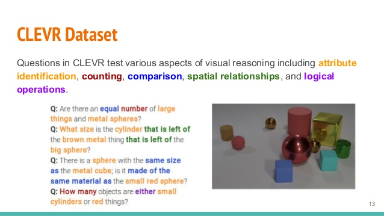

## Tensorflow implementation for Relation-network

## Introduction
This is a Tensorflow Implementation of the paper "[A simple neural network module for relational reasoning]
(https://nurture.ai/p/089570b9-fe63-43af-8a25-76117d2a1c21)" as part of the [NIPS Global Paper Implementation Challenge]
(https://nurture.ai/nips-challenge)
This project include a Relation Neural-Network model, a **Sort-of-Clevr** dataset generator, trainer and evaluator.
The model can be trained on both **Clevr** dataset or **Sort-of-Clevr** dataset. But since the training on **Clevr** is too slow, I only
managed to train this model on **Sort-of-Clevr**.

## Relation Network
Relational reasoning is an important part in Artificial Intelligence. The purpose for this model is to solve the **Visual-Question-Answer(VQA)**
challenge with regards to relational question. Here is an example for **Clevr** dataset:

<p align="center">
  ,
</p>

This dataset contains 70000 scenes and 699989 question-answer, approximately 10 question per image. And there are 28 possible answers.
## Relation Module
This is the crucial part of the whole network. Where each object(pixels have the same coordinate in the final feature map) would be tagged
with the coordinate, then every two of object and question embedding would be concatenated to form a relation. Then each realtion is feed into
g_theta which is a four layer MLP, element-wise sum over all the output and then feed into f_theta to get the final output. The formula can be written as:

<p align="center">
    ,
</p>

And the whole architecture:

<p align="center">
    
</p>

## Result for Clevr
Still under training...

## Sort-of-Clevr
On the contrast to Clevr, a relatively easy dataset was proposed in this papar and it's called **Sort-of-clevr**. This dataset has
10000 scenes and 20 question-answer pair per image. Each question belongs to one of the six categories, see the experiment for more detail.
Each image is generated by randomly put several object on the scene, the shape of the object could be either **Circle** or **Square**, and 
there is no collison between any two of them. Here is an example:

<p align="center">
  ,
</p>

Given a color, all the possible questions are as follow:

**Non-relation questions**
* Is it a circle or a square?
* Is it closer to the top of the image?
* Is it on the right of the image?

**Relational questions**

* the shape of the farthest object?
* The shape of the nearest object?
* How many objects have the same shape(include itself)?

Then the question would be encoded into a 11-dimension vector, in the form : [blue, green, red, yellow, magenta, cyan, relation, non-relation, question1, question2, question3],
with binary representation. This would alleviate the procedure to train a LSTM encoder.

## Usage

### Datasets

Generate a default Sort-of-CLEVR dataset:

```bash
$ python SClevr_generator.py
```

Or generate your own Sort-of-CLEVR dataset by specifying args:

```bash
$ python SClevr_generator.py --dataset_size 10000 --image_size 128 --num_obj 5 --split_rate 2e-2
```

### Training

```bash
$ python Trainer.py
```

Or specify your own settings:

```bash
$ python trainer.py --model sclevr --restore True
```
The more detailed configuration can be found in [utils.py](https://github.com/obitto/relation-network/blob/master/utils.py)

### Testing

```bash
$ python evaluator.py
```
### Experiment Result
The test is conducted on image with 6 shape, training set has 9800 scenes and testing set has 200 scenes. Each image has size 80 x 80.

| | RN model |
| --- | --- |
| Non-relational question | **97.85%** |
| Relational question | **76.6%** |
| Overall | **87.225%** |


| Acc for each type of question| RN model |
| --- | --- |
| the shape of the farthest object? | **75.78%** |
| The shape of the nearest object? | **71.10%** |
| How many objects have the same shape(include itself)? | **83.20%** |
| Is it a circle or a square? | **98.10%** |
| Is it closer to the top of the image? | **97.03%** |
| Is it on the right of the image? | **98.42%** |

We can see this module has some problem with distance related question. This could because the model in this paper has 
much more filter in the convolution layer(where I have 24 in each layer) and much more MLP unit in f_theta. But still, it's an huge
improvement compared to the baseline model reported in this paper.


